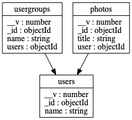

[](https://codeclimate.com/github/leonardodalcin/mongo-auto-erd/test_coverage)
<a href="https://twitter.com/acdlite/status/974390255393505280">
</a>

# mongo-auto-erd

This is an Entity Relationship Diagram generator for MongoDB databases. Given a connection url, it performs reverse engineering by map reducing db collections into a well defined interface with properties and it's relationships.

## Caveats

This lib will only generate `.svg`, `.png` and `.dot` formats if `graphviz` is installed. Graphviz is a quasi
standart library to generate `graphs`, their creators proposed the `.dot` language for graph representations, I
opted to use
it because it is
compatible or
convertible to many graph editing platforms.

If you don't want to use `graphviz`, the software will output a well defined ERD interface:

```typescript
export interface IEntity {
  name: string
  properties: IProperty[]
  relationships: IRelationship[]
}

export interface IProperty extends IMapReducedProperty {
  types: IPropertyType[]
}

export type IPropertyType =
  | 'string'
  | 'undefined'
  | 'null'
  | 'number'
  | 'objectId'
  | 'boolean'
  | 'unknown'
  | 'array'
  | 'function'
  | 'symbol'
  | 'bigint'
  | 'object'

export interface IRelationship {
  propertyNames: string[]
  targetCollectionName: string
}

export interface IMapReducedProperty {
  name: string
  values: any[]
}
```
[Example .json output](erd.json)

## Usage

`mongo-erd --uri mongodb://127.0.0.1:27017 --db dbname --outfile ./erd`

This command will produce a result like:


